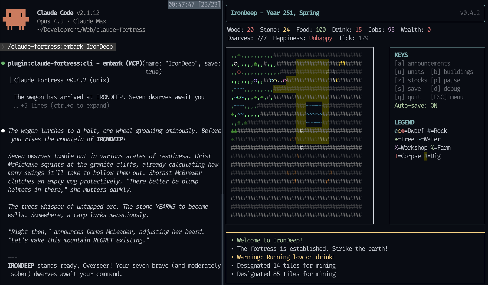

# Claude Fortress

**Strike the earth!** Command dwarves through natural language. Claude Code acts as your fortress overseer in this Dwarf Fortress-inspired ASCII simulation. Glory or death awaits. ⛏️

| | |
|:---:|:---:|
|  | <video src="https://github.com/user-attachments/assets/e6eb65b5-6e09-4a55-9b2c-a41e7a52489f" width="100%"></video> |

## Install

**Easiest:** Paste this URL into Claude Code and ask it to install the plugin:
```
https://github.com/brimtown/claude-fortress
```

Claude will handle dependencies and setup for your platform.

---

**Manual install** (if you prefer):

### macOS / Linux

```bash
# macOS
brew install oven-sh/bun/bun tmux

# Linux
curl -fsSL https://bun.sh/install | bash && sudo apt install tmux
```

### Windows

**Option 1: Windows Terminal (Recommended)**

Most Windows 11 users already have Windows Terminal. For Windows 10, [install it from the Microsoft Store](https://aka.ms/terminal).

```powershell
# Install Bun
irm bun.sh/install.ps1 | iex
```

Run Claude Code from PowerShell inside Windows Terminal. The fortress will open in a split pane.

> **Note:** Each `/embark` creates a new pane. Close old fortress panes manually.

**Option 2: WSL**

If you already have WSL set up, this gives the best experience with full tmux support:

```bash
# Inside WSL
curl -fsSL https://bun.sh/install | bash && sudo apt install tmux
```

Run Claude Code from inside WSL (`wsl` → `claude`).

**Not supported:** Git Bash does not support split-pane display.

### Add the Plugin

In Claude Code:
```
/plugin marketplace add brimtown/claude-fortress
/plugin install claude-fortress
```

### Update the Plugin

```
/plugin update claude-fortress@brimtown/claude-fortress
```

### Enable Auto-Updates

1. Run `/plugin` to open the plugin manager
2. Select the **Marketplaces** tab
3. Choose **brimtown/claude-fortress**
4. Select **Enable auto-update**

## Play

Start tmux (macOS/Linux/WSL) or use Windows Terminal, launch Claude Code, then:

```
/claude-fortress:embark
```

Or just say **"Strike the earth!"**

Claude spawns a fortress and you command it naturally:
- *"Dig out a great hall to the east"*
- *"Build a still so we can make booze"*
- *"How are my dwarves doing?"*

## Commands

| Command | Description |
|---------|-------------|
| `/claude-fortress:embark` | Embark on a new fortress |
| `/claude-fortress:embark Irondeep` | Embark with a custom name |
| `/claude-fortress:resume` | Resume a saved fortress |

Or trigger naturally with: "strike the earth", "fortress", "embark", "resume my fortress"

### Resuming

Use `/claude-fortress:resume` to open the save picker and return to a previous fortress. The picker shows all your saved fortresses sorted by most recent:

```
┌─────────────────────────────────────────┐
│ FORTRESS ARCHIVES - 5 saves found       │
├─────────────────────────────────────────┤
│ > Irondeep      Y252  7/7   Active      │
│   Doomgate      Y251  0/8   FALLEN      │
│   Copperhold    Y250  12/12 Active      │
└─────────────────────────────────────────┘
  [↑/↓] Navigate  [Enter] Resume  [D] Delete
```

- **Arrow keys** to navigate
- **Enter** to resume the selected fortress
- **D** to delete a save (with confirmation)
- **Q/Esc** to cancel

## Features

- Real-time ASCII simulation (500ms ticks)
- Dwarf needs: hunger, thirst, happiness
- Death by starvation/dehydration
- Grief system and tantrum spirals
- Strange moods and artifact creation
- Job system: dig, build, assign labor
- Wealth-based migration
- Fortress collapse with end-game statistics
- Autosave to `~/.claude/fortress-saves/`

## Troubleshooting

| Problem | Solution |
|---------|----------|
| "Raw mode not supported" | Run inside tmux (macOS/Linux/WSL) |
| "Windows Terminal required" | Install from https://aka.ms/terminal |
| Socket not created | Run `cd canvas && bun install` |
| Bun not found | Restart terminal after install |
| Git Bash: no split pane | Use Windows Terminal or WSL instead |

## Development

```bash
git clone https://github.com/brimtown/claude-fortress.git
cd claude-fortress && ./install.sh
```

See [DEVELOPER_NOTES.md](DEVELOPER_NOTES.md) for architecture details and [specs/](specs/) for game system documentation.

## License

MIT — Inspired by [Dwarf Fortress](https://www.bay12games.com/dwarves/), built on [claude-canvas](https://github.com/dvdsgl/claude-canvas)
