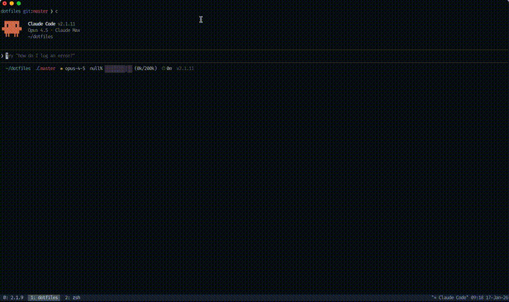

# Claude Fortress

**Strike the earth!** Command dwarves through natural language. Claude Code acts as your fortress overseer in this Dwarf Fortress-inspired ASCII simulation. Glory or death awaits. ⛏️



## Install

**Prerequisites:** [Bun](https://bun.sh), [tmux](https://github.com/tmux/tmux), [Claude Code](https://claude.ai/code)

```bash
# macOS
brew install oven-sh/bun/bun tmux

# Linux
curl -fsSL https://bun.sh/install | bash && sudo apt install tmux
```

**Add the plugin** (in Claude Code):
```
/plugin marketplace add brimtown/claude-fortress
/plugin install claude-fortress
```

## Play

Start tmux, launch Claude Code, then:

```
/claude-fortress:embark
```

Or just say **"Strike the earth!"**

Claude spawns a fortress and you command it naturally:
- *"Dig out a great hall to the east"*
- *"Build a still so we can make booze"*
- *"How are my dwarves doing?"*

## Commands

| Command | Description |
|---------|-------------|
| `/claude-fortress:embark` | Embark on a new fortress |
| `/claude-fortress:embark Irondeep` | Embark with a custom name |

Or trigger naturally with: "strike the earth", "fortress", "embark", "let's play dwarves"

## Features

- Real-time ASCII simulation (500ms ticks)
- Dwarf needs: hunger, thirst, happiness
- Death by starvation/dehydration
- Grief system and tantrum spirals
- Strange moods and artifact creation
- Job system: dig, build, assign labor
- Wealth-based migration
- Fortress collapse with end-game statistics
- Autosave to `~/.claude/fortress-saves/`

## Troubleshooting

| Problem | Solution |
|---------|----------|
| "Raw mode not supported" | Run inside tmux |
| Socket not created | Run `cd canvas && bun install` |
| Bun not found | Restart terminal after install |

## Development

```bash
git clone https://github.com/brimtown/claude-fortress.git
cd claude-fortress && ./install.sh
```

See [DEVELOPER_NOTES.md](DEVELOPER_NOTES.md) for architecture details.

## License

MIT — Inspired by [Dwarf Fortress](https://www.bay12games.com/dwarves/), built on [claude-canvas](https://github.com/dvdsgl/claude-canvas)
