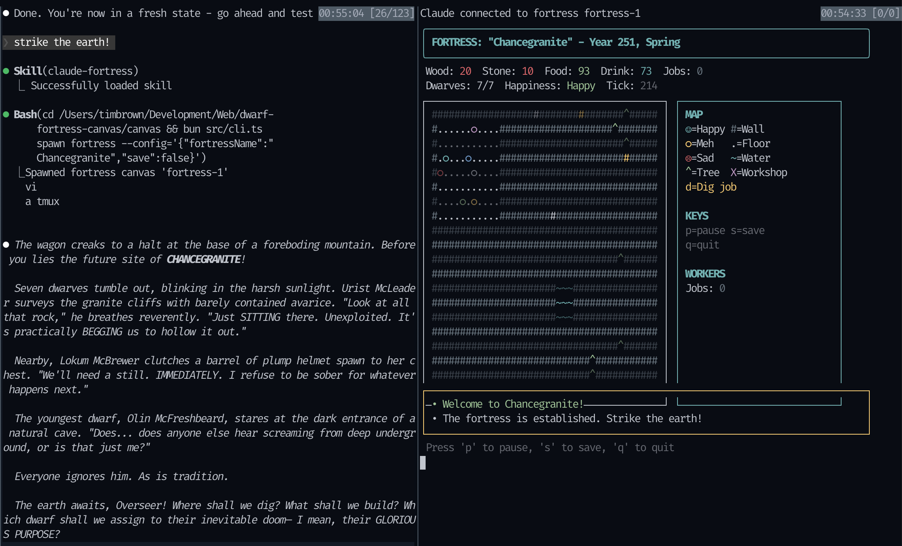

# Claude Fortress

A Dwarf Fortress-inspired simulation where Claude Code acts as your fortress overseer. Spawn an ASCII fortress in your terminal and command dwarves through natural language!



## Requirements

- [Bun](https://bun.sh) - JavaScript runtime (v1.0+)
- [tmux](https://github.com/tmux/tmux) - Terminal multiplexer (canvases spawn in split panes)
- [Claude Code](https://docs.anthropic.com/en/docs/claude-code) - CLI for Claude

## Installation

### 1. Install Bun

```bash
# macOS/Linux
curl -fsSL https://bun.sh/install | bash

# Or via Homebrew (macOS)
brew install oven-sh/bun/bun

# Verify installation
bun --version
```

### 2. Install tmux

```bash
# macOS
brew install tmux

# Ubuntu/Debian
sudo apt install tmux

# Verify installation
tmux -V
```

### 3. Install the Plugin

```bash
# In Claude Code, run:
/plugin marketplace add brimtown/claude-fortress
/plugin install claude-fortress@claude-fortress
```

That's it! The plugin system handles everything automatically.

#### Alternative: Manual Installation

If you prefer to clone the repo directly:

```bash
git clone https://github.com/brimtown/claude-fortress.git
cd claude-fortress
./install.sh
```

The install script will:
- Install bun dependencies
- Check for required tools (bun, tmux)

## Quick Start

1. **Start a tmux session** (required for canvas panes):
   ```bash
   tmux new -s fortress
   ```

2. **Launch Claude Code** and say:
   ```
   Strike the earth!
   ```

3. Claude will spawn a fortress and you can command it naturally:
   - "Dig out a great hall to the east"
   - "Build a brewery"
   - "How are my dwarves doing?"

## Manual Usage

If you want to run without Claude Code:

```bash
cd canvas

# Spawn a fortress
bun run src/cli.ts spawn fortress --config='{"fortressName":"Irondeep","save":true}'

# Query state
bun run src/cli.ts query fortress-1

# Send commands via IPC
echo '{"type":"command","command":{"type":"dig","area":{"x":15,"y":5,"width":10,"height":5}}}' | nc -U /tmp/canvas-fortress-1.sock
```

## What's Implemented

- Real-time ASCII fortress simulation (500ms ticks)
- Natural language commands via Claude as overseer
- Dwarf movement and pathfinding
- Job system (dig, build, assign labor)
- Dwarf needs (hunger, thirst, happiness)
- Resource management (wood, stone, food, drink)
- Migrant waves and seasonal events
- Persistent save/load system
- IPC for programmatic control

## What's NOT Implemented (Yet)

- Death (dwarves complain but don't die)
- Workshop production (buildings exist but don't produce)
- Combat/military
- Z-levels (single floor only)
- Trading caravans

See [DEVELOPER_NOTES.md](DEVELOPER_NOTES.md) for the full roadmap.

## Troubleshooting

### "Raw mode is not supported"
Must run inside a real tmux pane with interactive stdin.

### Socket file not created
The fortress may have crashed on startup. Check that Bun dependencies are installed: `cd canvas && bun install`

### Bun not found
Ensure Bun is in your PATH. After installation, you may need to restart your terminal or run `source ~/.bashrc`.

## Development

See [DEVELOPER_NOTES.md](DEVELOPER_NOTES.md) for detailed development documentation.

## Contributing

PRs welcome! Good first issues:

- Add more dwarf name combinations
- Implement workshop production (stills make drink, etc.)
- Add death when hunger/thirst hit 100
- Color-code tiles by type
- Add more event variety

The codebase is ~50% inherited canvas framework, ~50% custom fortress simulation. The simulation lives in `canvas/src/lib/fortress-sim/`.

## License

MIT

## Acknowledgments

- Inspired by [Dwarf Fortress](https://www.bay12games.com/dwarves/)
- Built on [dvdsgl/claude-canvas](https://github.com/dvdsgl/claude-canvas)
- A collaboration between human creativity and Claude
